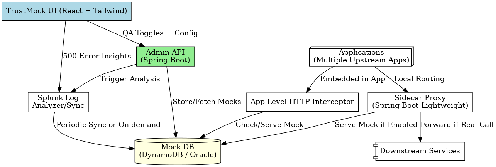

# TRUSTMOCK_OVERVIEW.md

## 🔍 What is TrustMock?

**TrustMock** is a smart mock response system for enterprise QA testing, enabling minimal-to-zero code changes in existing applications. It provides the ability to **toggle mock responses** for failing downstream services while keeping other services real-time and unaffected.

It helps **Quality Assurance (QA)** teams to:

- Proceed with testing even if some downstream services are down
- Reduce dependencies on complete service availability
- Manually or automatically toggle mock responses for failed services
- Analyze error logs via Splunk and suggest mock toggles using AI

---

## 🚀 Core Features

- **Per-App, Per-Endpoint Mock Toggle**
- **App-level HTTP Interceptor Mode**
- **Sidecar Proxy Mode (Zero Code Change)**
- **Fallback via Splunk Error Log Analysis**
- **Editable Mock Responses with Version Control**
- **Auto-Sanity Checks (Optional QA Mode)**
- **Web-based Admin UI with TIAA Theme**
- **Persistent Storage in DynamoDB or Oracle DB**
- **AI Assistant (Phase 2) to suggest mock toggles based on logs**

---

## 🏗️ Architecture Overview



---

## 📦 Modules

### Frontend (React + TailwindCSS + ShadCN)
- `Dashboard`: Shows mock toggles and downstream service statuses
- `Settings`: Manage environments, Splunk config, etc.
- `ChatAssistant`: (Phase 2) AI-driven assistant for log analysis
- `services/api.ts`: Axios setup for backend communication

### Backend (Java 21 + Spring WebFlux)
- `controller`: Admin APIs for toggling and managing mocks
- `interceptor`: Application-level HTTP interceptor
- `proxy`: Sidecar proxy routing logic
- `splunk`: Splunk integration for error log fetch and analysis
- `config`: Spring configurations and bean wiring
- `repository`: DB access layer (DynamoDB/Oracle)
- `model`: Data entities and DTOs
- `util`: Helper utilities for processing

---

## 🛠️ Integration Modes

| Mode             | Code Change | Use Case                              |
|------------------|-------------|----------------------------------------|
| App Interceptor  | Minimal     | Add HTTP filter inside app             |
| Sidecar Proxy    | None        | Traffic redirection at runtime         |
| Splunk Analyzer  | None        | Detect failing services via logs       |

---

## 🧠 Future Roadmap

- ✅ Versioned mock history
- ✅ Smart mock toggling via Splunk AI assistant
- ⏳ Multi-app dashboards with usage analytics
- ⏳ Real-time traffic analytics via proxy
- ⏳ API Test Suite auto-generation

---

## 🏁 Run Instructions

> Detailed README files are available in both frontend and backend projects.

1. **Backend** (Java, Spring WebFlux)
   - Open in IntelliJ (Java 21+)
   - Run `TrustMockApplication`
   - API runs on `http://localhost:8080`

2. **Frontend** (React, Vite, Tailwind)
   - Open in VSCode / PyCharm Pro
   - Run:
     ```bash
     npm install
     npm run dev
     ```
   - UI runs on `http://localhost:5173`

---

For video walkthrough and mock data demo — coming soon… 🎥

